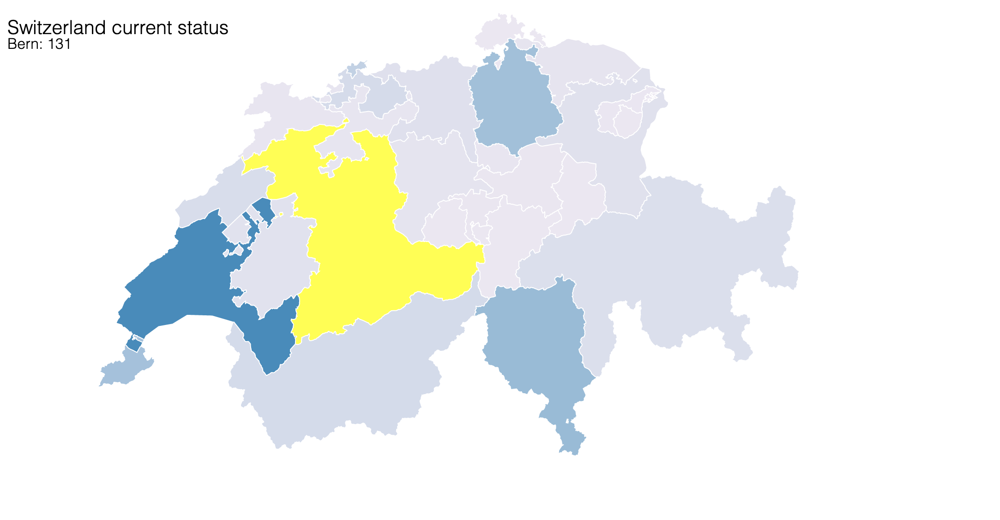
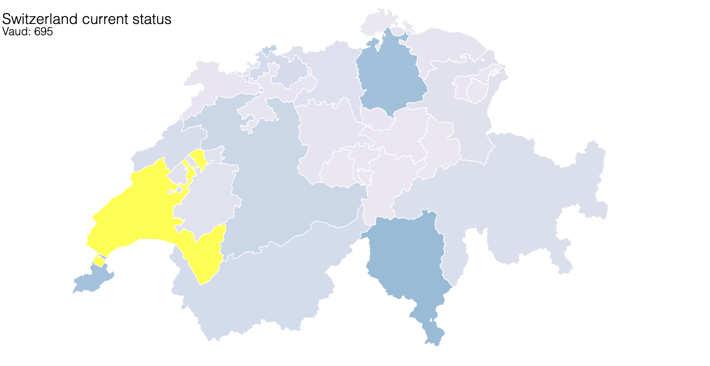
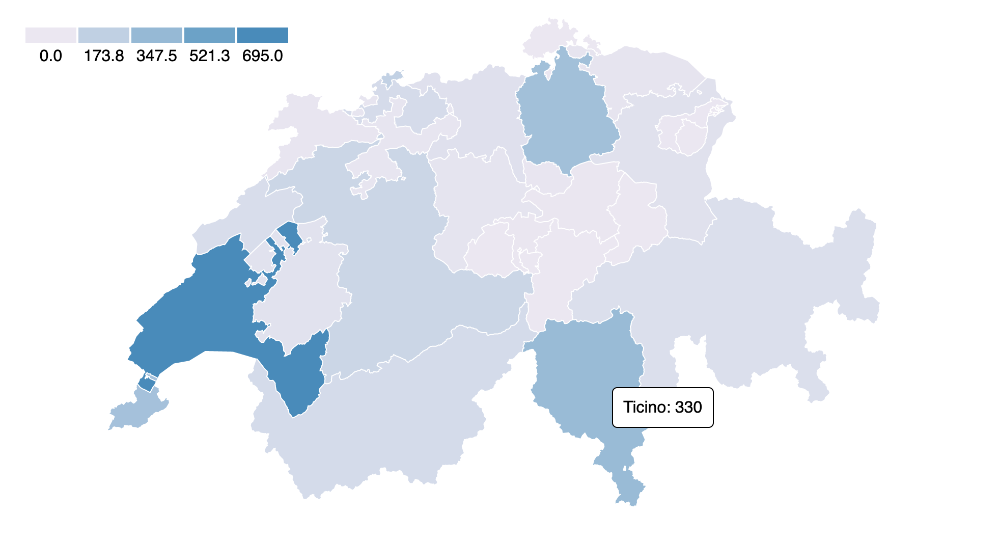
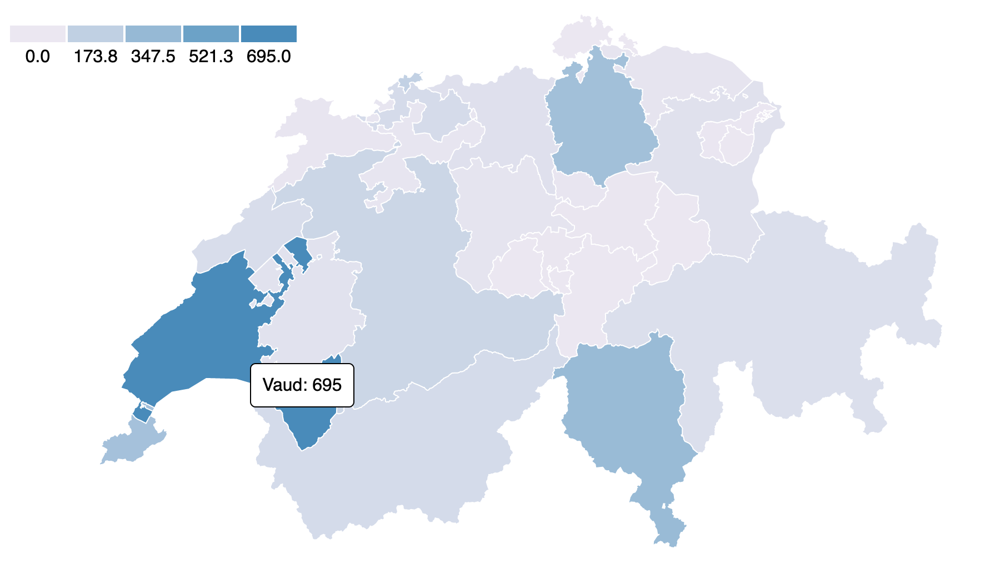

# SwissCoronaMap

Visualization project of the spread of COVID-19 in Switzerland per canton.
The purpose of the project is to learn about doing visualizations in D3.js while analyzing a topic of interest at the time of creating this.

## Usage

### Step 1: Clone this repository.
```
$ git clone https://github.com/valix25/SwissCoronaMap.git
```

### Step 2: Navigate to the SwissCoronaMap folder and start a dummy server
```
$ cd /path/to/SwissCoronaMap
$ python -m SimpleHTTPServer
```
### Step 3: Go to your http://localhost:8000/ and pick one of the html files to load the respective visualization


## Screenshots

> demo.html version 0.0.1





> demo.html version 0.1.0





## Data Sources

https://www.swissinfo.ch/eng/covid-19_switzerland-confirms-second-coronavirus-case/45582788

https://www.swissinfo.ch/eng/covid-19_coronavirus--the-situation-in-switzerland/45592192

https://en.wikipedia.org/wiki/2020_coronavirus_pandemic_in_Switzerland#cite_note-113

https://web.archive.org/web/20200316120424/https://www.bag.admin.ch/bag/en/home/krankheiten/ausbrueche-epidemien-pandemien/aktuelle-ausbrueche-epidemien/novel-cov/situation-schweiz-und-international.html

https://www.bag.admin.ch/bag/en/home/krankheiten/ausbrueche-epidemien-pandemien/aktuelle-ausbrueche-epidemien/novel-cov/situation-schweiz-und-international.html

https://github.com/interactivethings/swiss-maps (Used to obtain and draw the swiss topological map and its cantons)

http://duspviz.mit.edu/d3-workshop/mapping-data-with-d3/ (Source for the contents of the useful folder)
